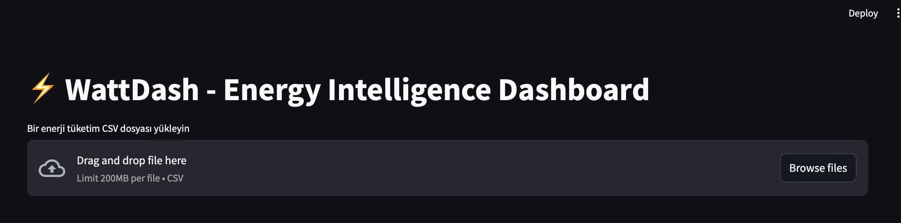
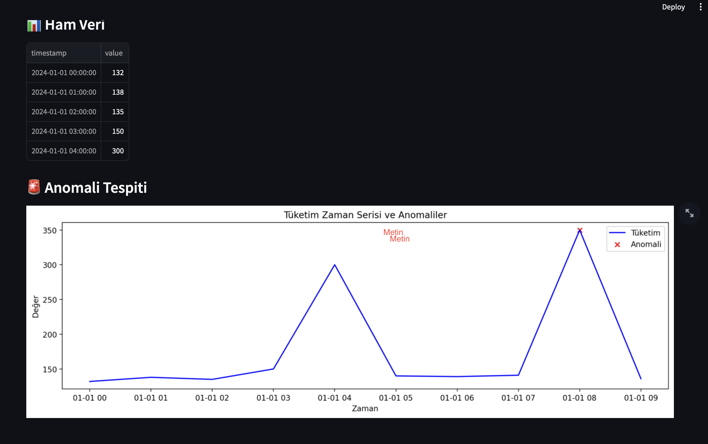
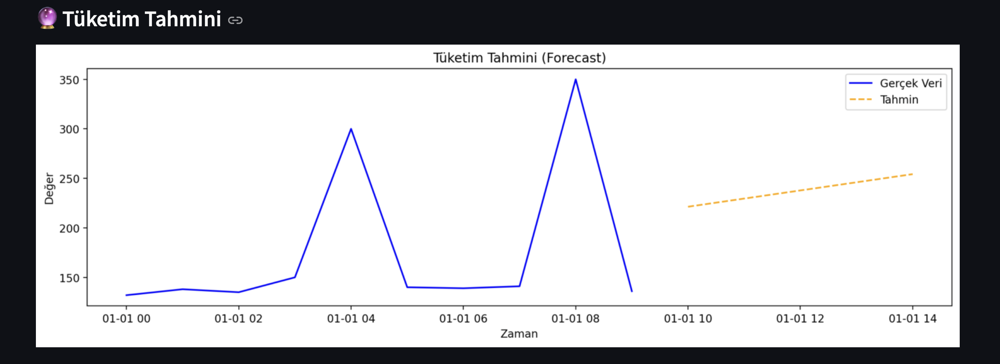
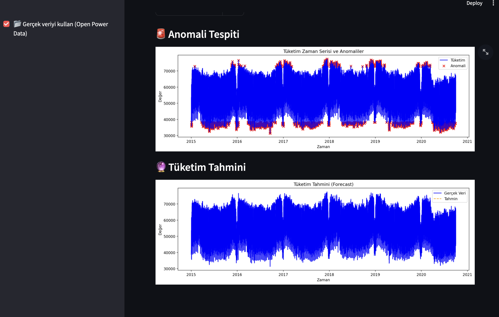
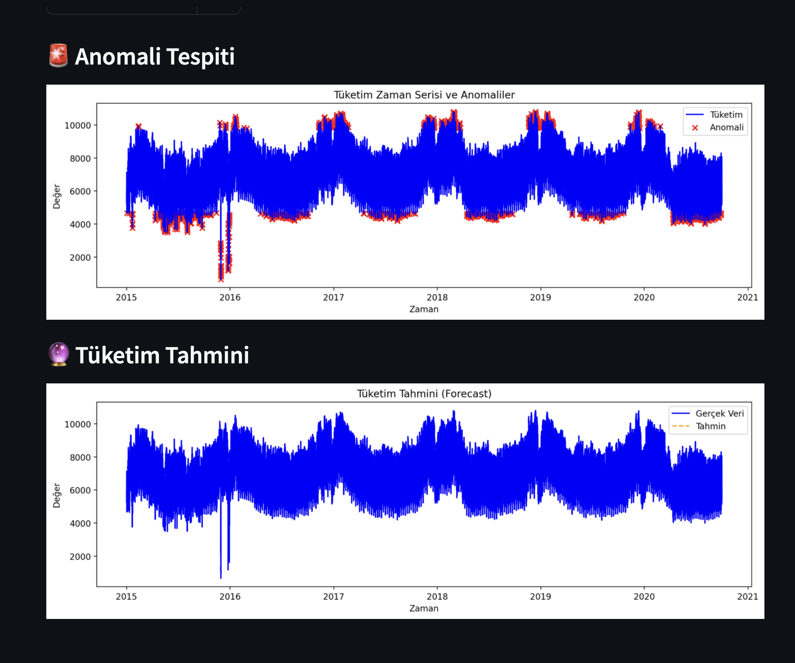
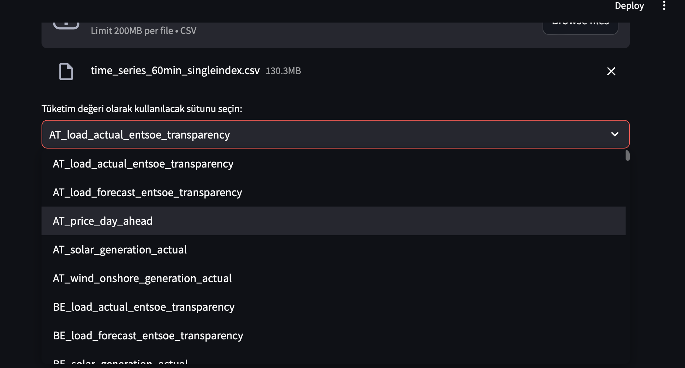
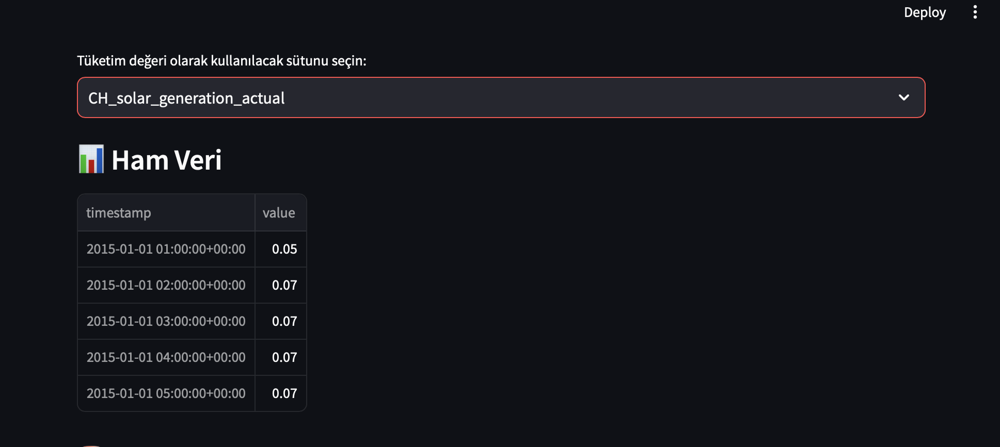
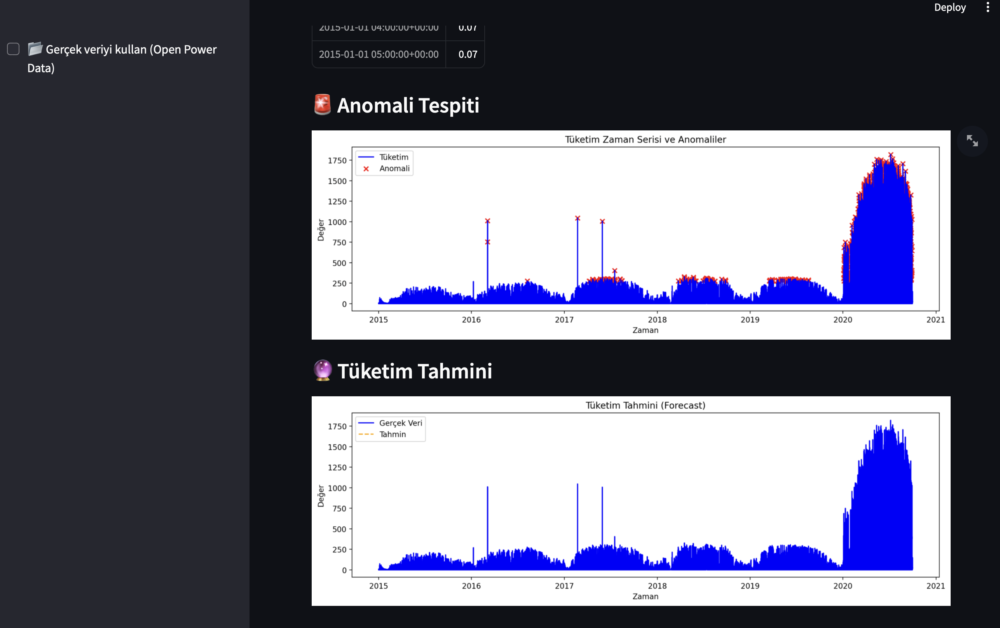

⚡ WattDash – AI-powered Energy Intelligence Dashboard

WattDash is a real-time energy analytics dashboard powered by machine learning.  
Designed for smart grid systems and IoT infrastructures, it offers:

- ⚙️ Anomaly detection using Isolation Forest  
- 🔮 Consumption forecasting with Linear Regression  
- 📊 Real-time energy data visualization  
- 🧠 Easy interface via Streamlit  

Whether you're a data analyst or an energy systems engineer, WattDash enables actionable insights in seconds.


📸 Preview Screenshots

📂 Upload Interface  
Streamlit-based user interface to upload a `.csv` energy dataset.  



🚨 Anomaly Detection  
Anomalies in energy consumption highlighted using Isolation Forest algorithm.  



🔮 Consumption Forecast  
Short-term future predictions powered by regression.  



 📂 Expected Input Format

The app accepts `.csv` files with the following structure:

```csv
timestamp,value
2024-01-01 00:00:00,132
2024-01-01 01:00:00,138
...


📸 Additional UI Screenshots

 ✅ 1. Forecasting and Anomaly Detection Using Real Data  
Visual output when real Open Power Data is used:



📂 2. Manual Data Upload  
Results when uploading a CSV file manually:



🧩 3. Column Selection Interface  
Dropdown interface for selecting the column to be used for analysis:



 ☀️ 4. CH_solar_generation_actual Selected  
Screenshot showing the selection of `CH_solar_generation_actual`:




📊 5. Output for CH_solar_generation_actual  
Anomaly detection and forecasting results for the selected solar data:


